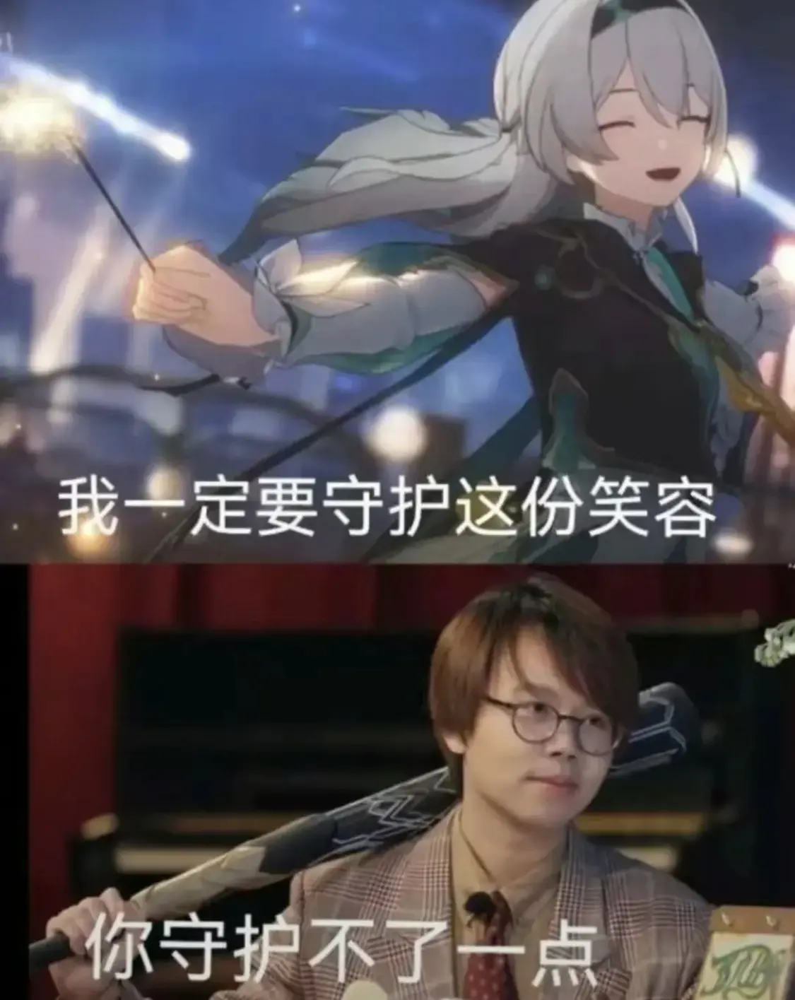

# \(it\)

「我梦见一片焦土，一株破土而生的新蕊，它迎着朝阳绽放，向我低语呢喃。」
人们为何选择沉睡？我想……
…是因为害怕从「梦」中醒来。 

## 流萤~酱~
> 流萤是米哈游的游戏[《崩坏：星穹铁道》](https://sr.mihoyo.com/)及其衍生作品的登场角色。
> 自称匹诺康尼鸢尾花家系的景区接待。~~（开局被刀的天降系女友）~~ 
> ~~个人状态:在梦境中死亡，生死未卜~~ 
> 个人状态:活了

> 流萤是一名「失熵症」的患者，物理结构会陷入不可逆的慢性解离，慢慢消失，而在旁人眼中甚至难以察觉。对现实的认知也会逐渐变得模糊，只能依靠医疗舱维持生命。

- ~~安啦，死不了一点她~~
- 你回想起和那个女孩共度的时光，她温柔的笑容，她轻盈的步伐，以及她最后一刻，被怪物斩杀时留下的泪…	

## 其他

### 2.0版本前瞻

> 有玩家根据OP《不眠之夜》中萨姆机甲发光的颜色和流萤的衣着配色相近的画面推测流萤和星核猎手萨姆存在密切的关系，甚至猜测萨姆实为流萤穿上铠甲后的样子。  

>在开拓续闻：狐斋志异中有一段剧情是桂乃芬在直播间询问开拓者的感情状态，而提供的其中一个选项是“丧偶”。这本来没什么问题，直到选了这个选项的开拓者们看到流萤被捅穿的场面，让该选项多了一点特殊的含义。

* 烧鸡老师称匹诺康尼的剧情“轻松、快乐、阳光”，开拓者将与当地人“进行一些敞开心扉~(掏心掏肺)~的交流”。

### 2.1 
> 真 · 见了一面   
其次，机甲老婆欸！
